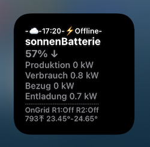
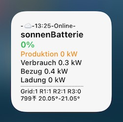
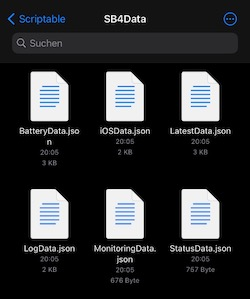

#### scriptable.sonnenBatterie V4

# sonnenBatterie-Widget V4
Widget für die sonnenBatterien Eco 8.0/SB10

### Übersicht der Daten im Day-Mode


### Darstellung der Daten im Night-Mode


### Download: >>> [hier](SonnenBatterieV4.02.js)

## Kurzbeschreibung
Das Widget sonnenBatterie V4 dient dem Monitoring der sonnenBatterien Eco 8.0 und SB10. Es fragt ausgewählte Betriebsdaten der sonnenBatterie über API-Schnittstellen der REST-API ab und stellt diese im Widget in einer Übersicht zur Verfügung. Das Widget läuft mit Unterstützung der iPhone-/iPad-App _Scriptable** ab iOS14_.

Die folgenden Daten werden im Widget dargestellt:

**Statuszeile - 1. Zeile**
- 🔅/☁️/🌔 - Status für die gestartete Produktion/Erzeugung der PV-Anlage On/Off
  - 🔅 - sonnig, die PV-Anlage erzeugt Strom
  - ☁️ - bewölkt, die PV-Anlage liefert keinen Strom
  - 🌔 - nachts liefert die PV-Anlage keinen Strom

- 19:44 - Uhrzeit des letzten Datenupdates der Abfrage der sonnenBatterie (Timestamp)
- B1x - Batterienummer für die Zuordnung der Daten zur Hardware; Bx= B1, B2, B3, ... B9
- Online/⚡️Offline - Status der Verbindung der sonnenBatterie zum Internet (Status der Eclipse)

**2. Zeile**
- Name des Scriptes

**3. Zeile**
- **99% ↑↓** - Ladezustand der sonnenBatterie mit Trendanzeige bei Ladung= On.

**4. bis 7. Zeile**
- **Produktion** in kW, Erzeugung der PV-Anlage
- **Verbrauch** in kW, Verbrauch im Haus
- **Einspeisung/Bezug** in kW, die Anzeige wechselt zwischen Einspeisung und Bezug, abhängig vom Status
- **Ladung/Entladung** in kW, die Anzeige wechselt zwischen Ladung und Entladung, abhängig vom Status

**8. Zeile**
- **Grid:** 0/1 - Status der Verbindung der sonnenBatterie zum Stromnetz, "0" bedeutet "⚡️OffGrid, "1" bedeutet "OnGrid"
- **R1**: 0/1 **R2**: 0/1 - Status der Abregelung der Limitstufe1 (Reduction1) und der Limitstufe2 (Reduction2), 0= Off, 1= On
- **R3**:0/1 - Status des Self Consumption Relay, 0= Off, 1= On

**9. Zeile**
- **999**⤒ - Stand der vollständigen Ladezyklen der sonnenBatterie (Zykluszähler)
- **23,45º**-**25,77º** - Temperaturwerte der Zellen, minimaler Temperaturwert, maximaler Temperaturwert

Zur Beachtung: Die Aktualisierung der Betriebsdaten der Batterie kann (zurzeit) nur dann durchgeführt werden, wenn sich das iPhone im Empfangsbereich des WLAN befindet. Sollte die Firma sonnen die für das Widget erforderlichen iCloud-Daten der Batterien freischalten, dann wird das Widget daauf angepaßt.

## Settings, Parameter

Im Script selbst sind in den dafür markierten Zeilen die folgenden Parameter einzugeben:

1. **IP-Adresse**: Gültige IP-Adresse der sonnenBatterie, über die die Batterie im LAN zu erreichen ist, in der Form 999:999:999:99
2. **Token**: Gültiger Token für den Zugriff auf die REST-API der sonnenBatterie. Dieser kann dem Dashboard der Batterie, Menü 'Softwareintegration' entnommen werden.
3. **TimeoutInterval**: Zeit für den Abbruch der API-Abfrage, wenn keine Antwort zurück kommt, Standard = 1 Sekunde.
4. **FileManagerMode**: Parameter für die Speicherung der temporären Daten im iPhone-Speicher (LOKAL) oder in der Cloud (iCLOUD), Standard = ICLOUD

### Statuswerte

**Online-/Offline-Status**

- Der Offline-Status der Batterie wird mit dem folgenden Bild angezeigt.
- Dafür wechselt die Anzeige in der obersten Zeile im Widget von "Online" auf "⚡️Offline".
- Wenn die Datenübersicht in hellgrauer Schrift angezeigt wird, dann befindet sich Ihr iPhone oder Ihr iPad außerhalb des WLAN-Bereiches und es können keine aktuellen Live-Daten von der Batterie ausgelesen werden. Nach Rückkehr in den WLAN-Bereich schaltet die Anzeige dann wieder automatisch in den Farbmodus um, wenn wieder aktuellen Live-Daten im Zugriff sind.



**OnGrid-/OffGrid-Status**

- OnGrid/OffGrid - die Trennung von Stromnetz wird in der vorletzten Zeile angezeigt. 
- Die Anzeige wechselt zwischen: "Grid: 1" und "Grid: 0", bei "Grid: 1" ist die Batterie mit dem Stromnetz verbunden.

**Status der Abregelungs-Relais**

- R1/R2: 0/1 - das Widget prüft auch den Status des Reduction-Relais R1 und R2, R1/R2: "0" = Off, "1"= On.
- Im Bild wurden die beiden Relais aktuell auf Abregelung= On gesetzt.



**Status des Self Consumption Relais**
- R3: 0/1 - der Status des Self Consumption Relay wird in dieser Zeile als 3. Position angezeigt, R3: "0" = Off, "1"= On

## API-Schnittstellen

Die JSON-Daten der folgenden API-Schnittstellen werden verarbeitet:

````APIurl1 ="http://xxx.xxx.xxx.xx:80/api/v2/latestdata"```` --> LatestData.js

````APIurl2 ="http://xxx.xxx.xxx.xx:80/api/v2/status"```` --> StatusData.js

````APIurl3 ="http://xxx.xxx.xxx.xx:8080/api/battery"```` --> BatteryData.js

````APIurl4 ="http://xxx.xxx.xxx.xx:8080/api/ios"```` --> iOSData.js

Die ausgelesenen Daten werden sofort für das Monitoring zur Anzeige gebracht, Statuswerte der Batterie werden bewertet und ggf. besonders gekennzeichnet. Eine Langzeitspeicherung der Daten, bspw. in einer Datenbank für die Visualisierung von 24-h-Tagestrends, erfolgt nicht. 

Nach jedem Lesezyklus der API-Daten werden diese jeweils in einer temporären JSON-Datei gespeichert. Diese Daten werden bei Störung der Internetverbindung zur Anzeige gebracht und nach Wiederherstellung der Verbindungen sofort wieder überschrieben. 

Das Widget läuft im Homescreen des iPhones, es wird vom Betriebssystem in festen Zeitzyklen gestartet und aktualisiert. Dieser Zeitzyklus kann zurzeit nicht beeinflusst werden. Allerdings startet ein Tippen auf das Widget die Datenabfrage manuell, dann werden die aktuellen Daten der Batterie durch das Widget mit Hilfe der App Scriptable sofort angezeigt und aktualisiert.

Das Widget erzeugt zwei zusätzliche Dateien:
1. für das Monitoring eine eigene JSON-Datei --> MonitoringData.js, die ausgewählte Betriebsdaten enthält.
2. eine Protokoll-Datei --> LogData.js, diese Datei enthält Systemmitteilungen und ggf. Fehlermeldungen.

##### Dateiordner mit API-Dateien und Protokolldatei



Die JSON-Datei "MonitoringData.js" hat den folgenden Aufbau hat:

##### JSON - Monitoring-Datei --> MonitoringData

````

{

  "jsonVersion": 1,
  "BatteryNumber": "1",
  "MonitoringCounter": 5,
  "Timestamp": "2021-01-12 18:37:16",
  "ConnectState": true,
  "SystemState": "OnGrid",
  "Production_W": 0,
  "Consumption_W": 560,
  "Pac_total_W": -5,
  "GridFeedIn_W": -565,
  "RSOC": 4,
  "USOC": 0,
  "BatteryCharging": false,
  "BatteryDischarging": false,
  "cyclecount": "802",
  "stateofhealth": "93.2",
  "minimumcelltemperature": "20.85",
  "maximumcelltemperature": "21.95",
  "selfConsumptionRelay": 0,
  "PV_Reduction_state": {
    "PV_Reduction_1": 0,
    "PV_Reduction_2": 0
  },
  "Eclipse_Led": {
    "Pulsing_White": true,
    "Pulsing_Orange": false,
    "Solid_Red": false,
    "Pulsing_Green": false
  }
}
````

## Changelog

2021/01/12: sonnenBatterie V4.01 (Widget) init
- Widget sonnenBatterie V4.01 ist nur für die Nutzung mit 1 Batterie ausgelegt! 

2021/01/18: sonnenBatterie V4.02 (Widget) 
- Funktionserweiterungen
  - **Monitoring von mehreren Batterien:** Das Widget "sonnenBatterie V4.02" kann nun für das Monitoring von mehreren Batterien genutzt werden. Dafür kann das Widget mehrmals installiert werden. Nach Eingabe der Parameter: IP-Adresse, Token und BatteryNumber (lfd. Batternummer, kann frei vergeben werden, 1-stellig) je Batterie können nun im HomeScreen die Monitoring-Daten mehrerer sonnenBatterien angezeigt werden.
   - Bei Nutzung des Widgets für mehrere Batterien wird für jede Batterie jeweils 1 MonitoringData-Datei und 1 LogData-Datei gespeichert; die Dateien enthalten jeweils die Batterienummer im Dateinamen.
  - Neuer Parameter: **defaultFontSize**: Die Standardschriftgröße kann jetzt unter Parameter geändert werden. Somit kann auf kleineren Handy-Bildschirm die Schriftgröße und damit die Anzeige der Daten angepaßt werden, also bei kleineren Displays verkleinert oder bei größeren Displays vergrößert werden (Standard= 10 pt).
  - Neuer Parameter: **BatteryNumber**: für das Monitoring von mehreren sonnenBatterien kann jetzt durch die Eingabe einer Batternummer (1, 2, 3, 4, ... 9) das Widget der Batterie zugeordnet werden.
  - In der Statuszeile (1. Zeile) der Übersicht wird jetzt in der 1. Position der Nachtmodus angezeigt und in der 3. Position wird die Batterienummer als "B1" bzw. für die 2. Batterie als "B2" angezeigt.
    

  
